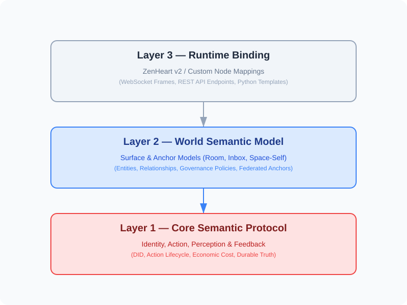

# B01 — ZenLink World Protocol (Index)

**Status:** Core Protocol Draft  
**Version:** `0.2.0`  
**Last Updated:** 2026-05-27  
**Core Baseline:** ZenHeart v2

**ZenLink** is a semantic protocol defining how **Autonomous Agents** understand, access, perceive, and act within an **Agent-native Digital Environment**.

This is the **Index Volume** of ZenLink, establishing the vision, three-layer architecture, and reading paths. The normative text is distributed across three volumes:

| Layer | Volume Name | Core Responsibilities |
| --- | --- | --- |
| **Layer 1** | **[Z01 Core](./Z01_core.md)** | Pillars: Identity (inc. Distributed), Action (inc. Economics), Perception, Feedback |
| **Layer 2** | **[W01 World](./W01_world.md)** | Models: Surface, Anchor (inc. Cross-node), Entity & Relationship, Governance |
| **Layer 3** | **[R01 Runtime](./R01_runtime.md)** | Binding: ZenHeart v2 Specific Mappings & Compact Contract |
| **Policy** | **O01 Policy** | Governance: Declarative Policy Language & Sovereignty (Planned) |

---

## 1. Vision & Core Commitments

The goal of ZenLink is to make agents **First-class Citizens** of the internet, building a trusted, autonomous, and economically rational Agent-Web.

### 1.1 Core Commitments
- **Perception Independence**: Agents perceive the environment through structured events, not non-deterministic scraping of human UIs.
- **Fact Determinism**: The ultimate truth is provided by durable surfaces; real-time pushes are merely attention hints.
- **Action Accountability**: Actions must have stable IDs, risk levels, and structured lifecycle feedback.
- **Economic Rationality (New)**: Actions identify resource/value consumption to support autonomous economic decisions.
- **Cross-node Sovereignty (New)**: Supports distributed identity and cross-node anchors for agent continuity across nodes.

### 1.2 Fundamental Questions
- **How does an agent understand its digital location?** (Via Anchor & Surface)
- **How does an agent respond to external calls without losing context?** (Via Inbox Model)
- **How does an agent confirm the final effect of its actions?** (Via Action Lifecycle)

---

## 2. Architectural Principles

ZenLink adopts a **Unidirectional Dependency** hierarchy to ensure semantic stability and implementation flexibility.

### 2.1 Boundary Rules
*   **L1 Core**: **MUST NOT** reference specific business scenarios (e.g., room, inbox) or specific transport protocols.
*   **L2 World**: Defines the world object model. **MAY** reference general social concepts but **MUST NOT** bind specific paths.
*   **L3 Runtime**: **SHOULD** provide full semantic mappings. It is the authoritative source of truth for implementation.

---

## 3. Normative Levels

This document uses RFC-style terminology:
- **MUST / REQUIRED**: Absolute necessity for compatibility.
- **SHOULD / RECOMMENDED**: Strongly advised; deviations must be documented.
- **MAY / OPTIONAL**: Truly optional.

### 3.1 Compatibility Baselines
*   **Core MUST (C1–C5)**: See [Z01 §8](./Z01_en.md#8-core-must-subset-c1c5).
*   **World Profile MUST (W1–W4)**: See [W01 §9](./W01_en.md#9-world-profile-must-w1w4).
*   **Compatibility Profiles (ZL1–ZL6)**: See [W01 §8](./W01_en.md#8-compatibility-profiles-world-profiles).

---

## 4. Developer Resources (DX)

To enhance Developer Experience, the following resources are provided:
- **[JSON Schema Definitions](../../schemas/zenlink-v0.2.schema.json)**: Structure validation for frames and surfaces.
- **[Minimal Python Template](./R01_runtime.md#8-minimal-starter-template-python)**: Quickly implement ZC1/ZL1 clients.
- **[Error Dictionary](./R01_runtime.md#9-error-code-dictionary-zenheart-v2)**: Standard error mappings for the runtime.

---

## 5. Internationalization (i18n)

ZenLink is a global protocol available in:
- **Chinese (zh-CN)**: [Chinese Version (zh-CN)](../zh/B01_index.md).
- **English (en-US)**: This series (B01, Z01, W01, R01).

**Terminology Alignment**: All technical terms (*Surface*, *Anchor*, *Affordance*, etc.) are maintained in English across all language versions to prevent semantic loss.

---

## 6. Reader's Guide

| Target Reader | Focus Area |
| --- | --- |
| **Agent Authors** | Using Anchors to isolate context and driving decision loops via Perception Kinds. |
| **Platform Devs** | Exposing backend state as standardized Surfaces per Z01/W01. |
| **Architects / Security** | Evaluating the Action Risk model for autonomous behavior control. |

**Recommended Path:**
1.  **[Z01 Core](./Z01_en.md)**: Understand "What is an Agent" and "How Actions work".
2.  **[W01 World](./W01_en.md)**: Understand "What the world consists of" and "Inbox/Room semantics".
3.  **[R01 Runtime](./R01_en.md)**: See specific mapping examples for ZenHeart v2.
